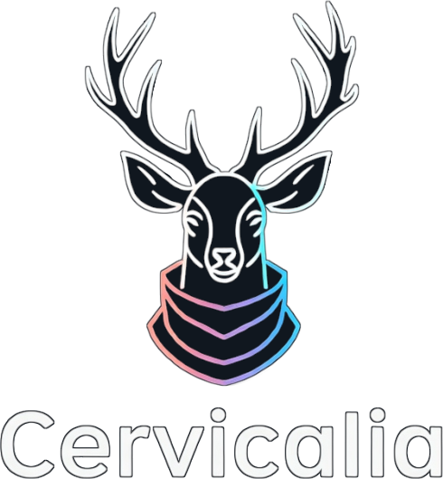
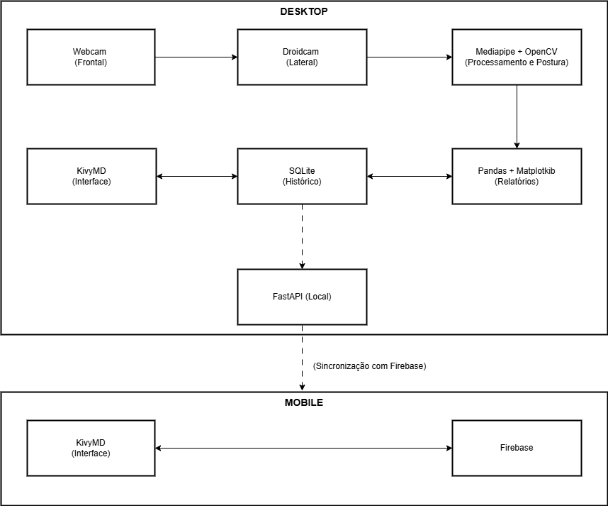
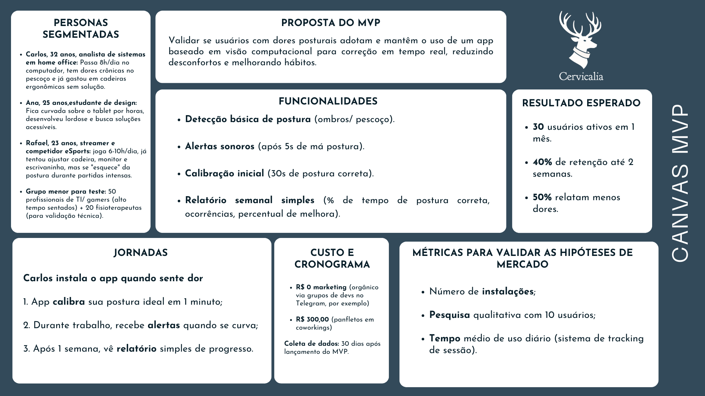
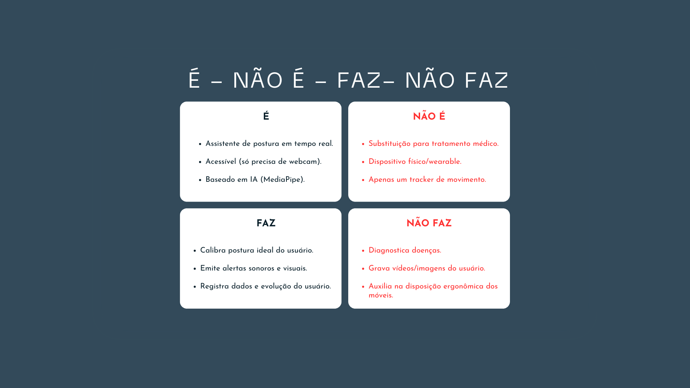
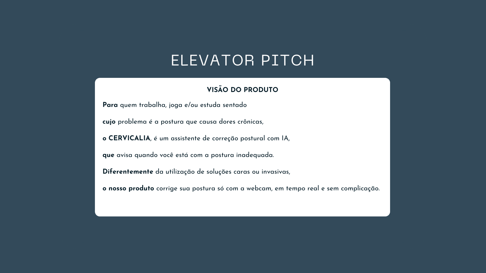

  

_Matheus Vinícius Pires Massing_

Este artigo apresenta a documentação do projeto **Cervicalia**, em conformidade com os requisitos da disciplina de Projeto de Desenvolvimento II, do curso de Análise e Desenvolvimento de Sistemas do Centro Universitário Senac-RS.

### 🚧 Projeto em desenvolvimento!
Para acompanhar o progresso das implementações descritas na documentação, [acesse a branch dev](https://github.com/MVMassing/cervicalia/tree/dev)

## Resumo do Projeto

A má postura adquirida durante longos períodos de home office ou estudo é uma das principais causas de dores crônicas no pescoço e nas costas. Essa condição compromete a saúde física e mental de milhões de trabalhadores e estudantes no mundo todo. O Cervicalia propõe uma solução tecnológica que utiliza visão computacional com múltiplas câmeras para detectar e alertar em tempo real sobre desvios posturais. Como consequência, a ferramenta promove maior consciência corporal, prevenção de lesões e aumento da produtividade, através de relatórios personalizados e notificações inteligentes.

## Definição do Problema

O crescimento do trabalho remoto e o aumento das horas de estudo em casa expuseram um problema silencioso, porém crescente: a má postura mantida por longos períodos sem correção imediata. Estudos indicam que 80% da população mundial relata dores posturais em algum momento da vida [(CNN Brasil)](https://www.cnnbrasil.com.br/saude/dores-nas-costas-atingem-80-da-populacao-mundial-veja-causas-e-como-evita-las/)
, o que resulta em redução de produtividade, aumento de afastamentos médicos, e custos com tratamentos fisioterapêuticos.

A maioria das soluções atuais de correção postural exige sensores físicos ou wearables, o que eleva o custo e dificulta a adoção em larga escala. Além disso, muitas ferramentas carecem de relatórios analíticos e não oferecem integração entre dispositivos móveis e desktops.

## Objetivos

### Objetivo Geral

Desenvolver uma aplicação multiplataforma capaz de detectar, alertar e documentar desvios de postura utilizando visão computacional e integração entre desktop e dispositivos móveis.

### Objetivos Específicos

* Implementar a detecção de postura com duas câmeras (webcam e celular). ⏳

* Exibir alertas visuais e sonoros em tempo real em caso de má postura. ✅

* Gerar dashboards interativos com horários críticos e progresso postural. ⏳

* Permitir sincronização de dados entre app Android e aplicativo desktop. ⏳

* Exportar relatórios em CSV e PDF para acompanhamento. ⏳

## Stack Tecnológico

#### Backend / Desktop

| Função                 | Tecnologia            |
|------------------------|------------------------|
| Backend/Desktop        | Python                |
| Visão Computacional    | OpenCV + MediaPipe    |
| Interface Desktop      | Kivy + KivyMD         |
| API Local              | FastAPI               |
| Processamento de Dados | Pandas + Matplotlib   |

#### App Android

| Função                | Tecnologia              |
|------------------------|--------------------------|
| Framework             | Kivy + KivyMD            |
| Conexão da Câmera     | DroidCam (USB/Wi-Fi)     |
| Notificações          | Firebase Cloud Messaging |

#### Banco de Dados & Sincronização

| Função               | Tecnologia |
|----------------------|------------|
| Banco Local (Desktop)| SQLite     |
| Banco na Nuvem       | Firebase   |

#### Infraestrutura & Deploy

| Componente             | Tecnologia |
|------------------------|------------|
| Deploy Frontend (Web)  | Vercel     |
| Deploy Backend (API)   | Render     |
| Versionamento          | Git + GitHub |

## Descrição da Solução

O Cervicalia é um sistema de correção postural que utiliza duas câmeras (webcam e celular) para monitorar a postura do usuário em tempo real. A aplicação desktop realiza a análise de imagem com MediaPipe e emite alertas sonoros e visuais sempre que a postura correta não é mantida por mais de alguns segundos.

A interface do sistema permitirá que o usuário visualize gráficos de progresso, exporte relatórios personalizados e configure os parâmetros de alerta. O aplicativo Android atua como visualizador e configurador remoto, além de utilizar a câmera lateral para melhor análise da posição corporal.

A sincronização ocorrerá por meio de um banco local (SQLite) e uma base na nuvem (Firebase), garantindo funcionalidade offline e mobilidade entre dispositivos.

## Arquitetura

O modelo de arquitetura adotado foi **Camadas Lógicas** (Inspirado em MVC), ainda que de forma implícita. Embora o **código inicial do MVP** esteja centralizado em um único script, é possível identificar separações conceituais entre:

* **Camada de Apresentação** – Responsável pela interface com o usuário, utilizando o OpenCV para exibição das imagens, desenhos de esqueleto e ângulos, e feedback visual da postura.

* **Camada de Processamento** – Contém a lógica de negócio do sistema, incluindo o cálculo dos ângulos do corpo, a calibração automática com base nos primeiros quadros e a verificação da postura com base nos limites calculados.

* **Camada de Infraestrutura** – Encarregada do acesso à câmera, da conversão de cores para o modelo do MediaPipe, do uso da biblioteca de áudio `playsound` para emitir alertas e da manipulação do sistema de arquivos com a biblioteca `os`.

---

### Modelo de Arquitetura

* 

---

### Visão Lógica

### Diagrama de Classes

Embora o código atual seja procedural, a lógica pode ser representada em termos de responsabilidades funcionais como se fossem classes/conjuntos:

⏳ 

### Banco de Dados

O projeto em fase inicial de MVP  **não utiliza banco de dados**, uma vez que seu funcionamento é baseado em captura em tempo real e processamento local da imagem. No entanto, está sendo desenvolvida solução que registra os dados usando SQLite com uma estrutura semelhante a:

| id | timestamp           | angulo_ombro | angulo_pescoco | tipo_postura  |
|----|---------------------|--------------|----------------|----------------|
| 1  | 2025-05-13 10:45:00 | 65.2         | 42.8           | "Postura Ruim" |

### Demais Artefatos

## Validação
⏳ 

### Estratégia
⏳

### Consolidação dos Dados Coletados
⏳

## Conclusões
⏳

## Limitações do Projeto e Perspectivas Futuras
⏳

## Referências Bibliográficas

WAZLAWICK, Raul Sidnei. Metodologia de pesquisa para ciência da computação. Rio de Janeiro: Elsevier, 2009

## Demais Links

### [Configurações e Requisitos](readme/configuracoes_e_requisitos.md)

### [Desenvolvimento da Solução](readme/desenvolvimento_da_solucao.md)

### [POSTMORTEM](readme/postmortem.md)