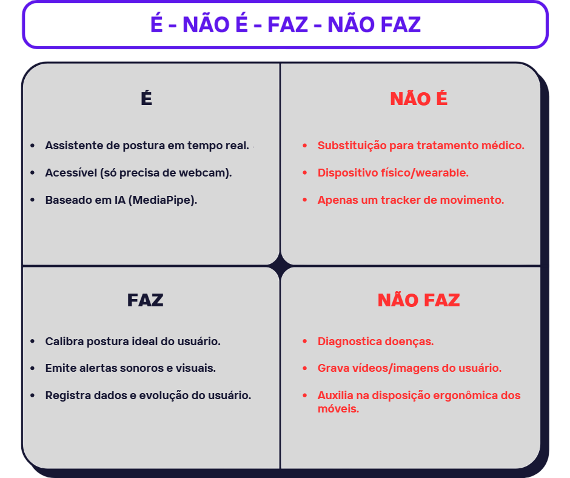

  

_Matheus Vinícius Pires Massing_

Este artigo apresenta a documentação do projeto **Cervicalia**, em conformidade com os requisitos da disciplina de Projeto de Desenvolvimento II, do curso de Análise e Desenvolvimento de Sistemas do Centro Universitário Senac-RS.

## Resumo do Projeto

A má postura adquirida durante longos períodos de home office ou estudo é uma das principais causas de dores crônicas no pescoço e nas costas. Essa condição compromete a saúde física e mental de milhões de trabalhadores e estudantes no mundo todo. O Cervicalia propõe uma solução tecnológica que utiliza visão computacional com múltiplas câmeras para detectar e alertar em tempo real sobre desvios posturais. Como consequência, a ferramenta promove maior consciência corporal, prevenção de lesões e aumento da produtividade, através de relatórios, gráficos e notificações ao usuário.

## Definição do Problema

O crescimento do trabalho remoto e o aumento das horas de estudo em casa expuseram um problema silencioso, porém crescente: a má postura mantida por longos períodos sem correção imediata. Estudos indicam que 80% da população mundial relata dores posturais em algum momento da vida [(CNN Brasil)](https://www.cnnbrasil.com.br/saude/dores-nas-costas-atingem-80-da-populacao-mundial-veja-causas-e-como-evita-las/), o que resulta em redução de produtividade, aumento de afastamentos médicos, e custos com tratamentos fisioterapêuticos.

A maioria das soluções atuais de correção postural exige sensores físicos ou wearables, o que eleva o custo e dificulta a adoção em larga escala. Além disso, muitas ferramentas carecem de relatórios analíticos e não oferecem integração entre dispositivos móveis e desktops.

## Objetivos

### Objetivo Geral

Desenvolver uma aplicação capaz de detectar, alertar e documentar desvios de postura utilizando visão computacional.

### Objetivos Específicos

* Implementar a detecção de postura com duas câmeras (webcam e celular). ✅

* Exibir alertas visuais e sonoros em tempo real em caso de má postura. ✅

* Gerar dashboards interativos com estatísticas e progresso postural. ✅

## Stack Tecnológico

| Função                 | Tecnologia            |
|------------------------|------------------------|
| Backend/Desktop        | Python                |
| Visão Computacional    | OpenCV + MediaPipe    |
| Interface Desktop      | Kivy + KivyMD         |
| Processamento de Dados | Pandas + Matplotlib + Openpyxl |
| Conexão da Câmera     | DroidCam (USB/Wi-Fi)   |
| Banco Local (Desktop)| SQLite     |
| Versionamento          | Git + GitHub |

## Descrição da Solução

O Cervicalia é um sistema de correção postural que utiliza duas câmeras (uma webcam e um celular) para monitoramento em tempo real da postura do usuário. A aplicação desktop realiza a análise das imagens por meio do MediaPipe e emite alertas sonoros e visuais sempre que a postura adequada não é mantida por alguns segundos consecutivos.

A interface do sistema permite ao usuário acompanhar gráficos de progresso e exportar relatórios gerados a partir do banco de dados SQLite.

## Arquitetura

O Cervicalia adota a **Clean Architecture** como modelo estrutural, promovendo uma separação clara de responsabilidades entre as camadas do sistema. Essa abordagem favorece a escalabilidade, testabilidade e manutenção da aplicação, sendo especialmente adaptada para cenários que envolvem visão computacional e múltiplas fontes de entrada. A arquitetura é composta por quatro camadas principais:

- **Presentation Layer**: Interface com o usuário (telas Kivy).
- **Application Layer**: Lógica de negócio e casos de uso.
- **Domain Layer**: Entidades e contratos (interfaces).
- **Infrastructure Layer**: Implementações técnicas (banco, câmera, UI).

---

### Fluxo de Funcionamento

**1. Captura da Imagem**
- **Webcam (frontal):** Monitora ombros e pescoço.
- **Celular (lateral via DroidCam):** Analisa curvatura cervical.

**2. Processamento em Tempo Real**
- **MediaPipe + OpenCV:** Detectam pontos-chave do corpo.
- **Algoritmo de Ângulos:** Calcula inclinação dos ombros e pescoço.

**3. Feedback e Alertas**
- **Sonoro, via playsound:** `alert.wav`.
- **Visual:** Via KivyMD indicando a qualidade da postura.

**4. Armazenamento Local**
- **SQLite:** Registra eventos de má postura.

**5. Relatórios**
- **Pandas + Matplotlib + Openpyxl:** Geram gráficos e exportam arquivos em CSV/PDF.

## Visão Lógica

### Banco de Dados

O armazenamento de dados do Cervicalia foi desenvolvido utilizando **SQLite**, com uma estrutura eficiente para registrar os resultados da análise postural. A tabela principal, `posture_records`, armazena os dados capturados pelas câmeras em tempo real, conforme o exemplo abaixo:

| id | timestamp           | shoulder_angle | neck_angle | camera  | is_poor_posture |
|----|---------------------|----------------|------------|---------|-----------------|
| 1  | 2025-05-13 10:45:00 | 65.2           | 42.8       | Lateral | 1               |
| 2  | 2025-05-13 10:47:00 | 68.2           | 43.6       | Frontal | 1               |

### Estrutura da Tabela: `posture_records`

| Coluna             | Tipo SQLite | Restrições / Validação                                                   |
|--------------------|-------------|---------------------------------------------------------------------------|
| `id`               | INTEGER     | PRIMARY KEY AUTOINCREMENT                                                 |
| `timestamp`        | TEXT        | NOT NULL — formato ISO 8601 (`YYYY-MM-DD HH:MM:SS`)                       |
| `shoulder_angle`   | REAL        | NOT NULL — valor numérico representando o ângulo do ombro em graus       |
| `neck_angle`       | REAL        | NOT NULL — valor numérico representando o ângulo do pescoço em graus     |
| `camera`           | TEXT        | NOT NULL — **valores permitidos**: `'lateral'` ou `'frontal'`             |
| `is_poor_posture`  | INTEGER     | NOT NULL — atualmente retorna apenas `1`, mas será utilizado futuramente |

### Observações

- O campo `timestamp` armazena os dados no formato **ISO 8601**, garantindo padronização e fácil ordenação cronológica.
- A coluna `is_poor_posture` é **irrelevante na versão beta-v.1.0.0**, pois sempre retorna `1`. No entanto, assim como a tabela `calibration_records`, será essencial em versões futuras para o **treinamento de modelos de IA**, permitindo que o sistema compreenda e se adapte às necessidades específicas de cada usuário.

---

### Demais Artefatos

---

## Validação

### Período de Análise

O período analisado compreendeu os dias **27 de junho a 04 de julho de 2025**, totalizando **sete dias consecutivos** de registros de má postura capturados pelo sistema. Os dados coletados foram utilizados para avaliar a eficácia do sistema na identificação e correção de posturas inadequadas por meio de alertas emitidos ao usuário em tempo quase real.

### Estratégia

Devido às restrições de tempo previstas no cronograma do projeto, não foi possível aplicar testes com uma base diversificada de usuários. Assim, a validação ocorreu com o próprio desenvolvedor da aplicação, que utilizou o sistema durante sua rotina diária para aferir funcionalidade, responsividade e impacto sobre o bem-estar postural.

Embora esse método represente uma limitação metodológica **(com potencial viés de confirmação)**, os resultados obtidos sugerem que o sistema possui potencial para influenciar positivamente o comportamento postural do usuário, mesmo em sua versão inicial.

### Consolidação dos Dados Coletados

Durante o período de testes, o sistema registrou um total de **1.172 ocorrências de má postura**. A seguir, destacam-se os principais dados consolidados:

- **Ocorrências no primeiro dia (27/06)**: 217
- **Ocorrências no último dia (04/07):** 113
- **Redução percentual entre o primeiro e o último dia:** 47,93%
- **Número total de ocorrências LATERAIS**: 687
- **Número total de ocorrências FRONTAIS**: 485

Os números demonstram uma **redução significativa das ocorrências** ao longo dos sete dias analisados, o que sugere um comportamento adaptativo do usuário frente aos alertas emitidos. Essa queda de aproximadamente 48% reforça o potencial da aplicação em promover a **correção postural progressiva** e contribuir para o bem-estar físico do usuário.

Além disso, observou-se uma **predominância de ocorrências laterais** (58,60%), que estão associadas a inclinações frontais do corpo. Esse padrão revela que o usuário tende a **se inclinar para frente com mais frequência** do que para os lados.

Essa tendência pode ser causada por fatores como:
- **Problemas de visão não corrigidos**, como astigmatismo;  
- **Altura inadequada entre a tela e a linha dos olhos**;  
- **Mobiliário não ergonômico ou má postura ao digitar**.

Identificar esses padrões possibilitará no futuro intervenções mais eficazes, como:
- **Ajustes na estação de trabalho**;  
- **Recomendações ergonômicas personalizadas**;  
- **Encaminhamentos médicos para avaliação oftalmológica**, se necessário.

## Conclusões

Os resultados indicam que o sistema é capaz de registrar, classificar e emitir alertas em resposta a comportamentos posturais inadequados de forma eficaz. A queda consistente no número de ocorrências ao longo da semana sugere que o uso contínuo da aplicação pode gerar mudanças comportamentais reais. Apesar do possível viés por ter sido testado apenas pelo próprio desenvolvedor, os dados são promissores.

## Limitações do Projeto e Perspectivas Futuras

### Alertas Sonotros

Um dos principais pontos de crítica levantados durante o seminário de andamento foi o **barulho excessivo dos alertas sonoros**, considerados invasivos. Estuda-se a substituição por **alertas visuais discretos**, como sobreposições leves na tela, permitindo que o sistema opere em segundo plano sem causar interrupções abruptas ao usuário.

### Dependência de Aplicativo Terceiro

Atualmente, a visão lateral depende do aplicativo **DroidCam**, o que gerou instabilidades e problemas de conexão. Uma das próximas metas é o **desenvolvimento de uma solução própria de captura lateral**, eliminando a dependência de apps de terceiros e aumentando a confiabilidade do sistema.

### Interface e Visualização de Dados

O foco do MVP foi o funcionamento do backend e dos **algoritmos de detecção postural**, com pouca ênfase no frontend. Embora os gráficos gerados via `matplotlib` tenham cumprido seu papel informativo, reconhece-se a necessidade de desenvolver **interfaces mais modernas, interativas e intuitivas**.

### Integração de Sugestões Personalizadas

Com base nas análises realizadas, vislumbra-se a possibilidade de integrar à aplicação **sugestões personalizadas de correção postural** com base no tipo e frequência das ocorrências detectadas. Essa funcionalidade poderia aumentar ainda mais o valor prático do sistema.

## [Configurações e Requisitos](readme/configuracoes_e_requisitos.md)

## Referências Bibliográficas

- **ZHU, C.; SHAO, R.; ZHANG, X.; GAO, S.; LI, B.** Application of Virtual Reality Based on Computer Vision in Sports Posture Correction. *Wireless Communications and Mobile Computing*, 2022, p. 1-15. [https://doi.org/10.1155/2022/3719971](https://doi.org/10.1155/2022/3719971)

- **CAI, D.; LIN, S.** A Study on Posture Correction Based on Computer Vision. In: *Applied Mechanics and Materials*, v. 513-517, p. 3207-3211, 2014. [https://doi.org/10.4028/www.scientific.net/AMM.513-517.3207](https://doi.org/10.4028/www.scientific.net/AMM.513-517.3207)

- **SITAPARA, S.; D.P., A.; JAIN, M.; SINGH, S.; GUPTA, N.** Novel Approach for Real-Time Exercise Posture Correction Using Computer Vision and CNN. In: *2023 International Conference on Ambient Intelligence, Knowledge Informatics and Industrial Electronics (AIKIIE)*, 2023, p. 1-6. [https://doi.org/10.1109/AIKIIE60097.2023.10389979](https://doi.org/10.1109/AIKIIE60097.2023.10389979)

- **TAN, Z.; SEOW, B.** Development of a Posture Corrector Device with Data Analysis System. In: *Lecture Notes in Mechanical Engineering*, 2022. [https://doi.org/10.1007/978-981-16-8954-3_1](https://doi.org/10.1007/978-981-16-8954-3_1)

- **RAJU, J.; REDDY, Y.; PRADEEPREDDY, G.** Smart Posture Detection and Correction System Using Skeletal Points Extraction. In: *Learning and Analytics in Intelligent Systems*, 2019. [https://doi.org/10.1007/978-3-030-24322-7_23](https://doi.org/10.1007/978-3-030-24322-7_23)
